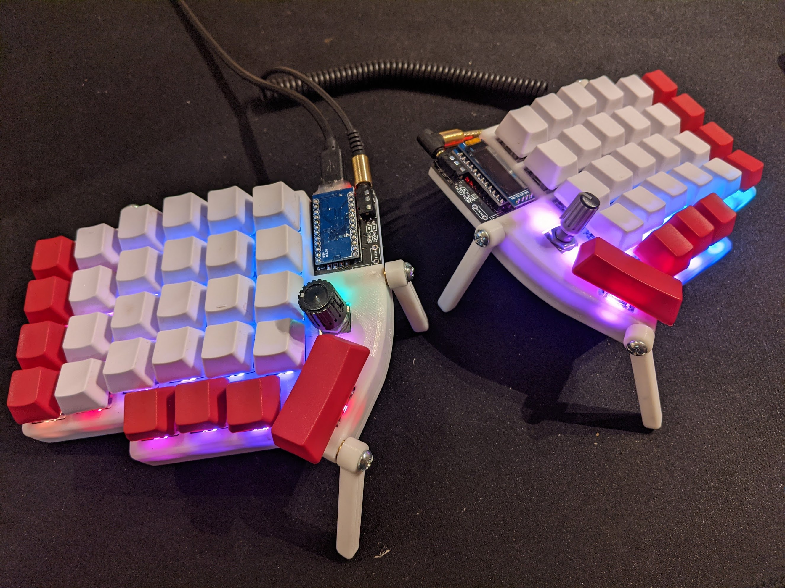

# Lily58 × qtkb Glow + Rotary Encoders designed for Wireless

This is a project to edit the Lily58 x qtkb Glow + Rotary Encoders to make it easily compatible with wireless settings. This is designed for the nice!nano, and will have a battery disconnect switch, no TRRS jack, DIP switches to control power to OLED, per-key LEDs, and underglow LEDs. Very much a work in progress until there is an initial release. Hoping to have this modified and ready shortly after I receive my Boardsource.xyz Lulu (Lily58 compatible) case. Stay tuned!

3/31/2022 Work is progressing. I am struggling to find a solid SPDT switch that will be easily reachable for LED purposes. But I think I've got it figured out besides that.

Original:

This is a mostly finished project, with some caveats. The keyboard works great with all features, except for the lights. They are functional, but I haven't been able to get the firmware to control both sides, and I had to wire the led data backwards due to ordering the wrong LEDs. However, the PCB and case are both solid and functional, and the lighting may just need some software tweaks I haven't yet cracked.

Lily58 is 6×4+4keys column-staggered split keyboard.
This fork adds an encoder to the key below the controller.

I got this board manufactured by JLCPCB. Just upload the file called gerber.zip to their quote tool, choose how many (5 is minimum), choose your color, (default options are fine) and order! Mine were $8.40 for a set of 5 and $9.03 shipping in July 2020.

## PCB Front

## PCB Back

